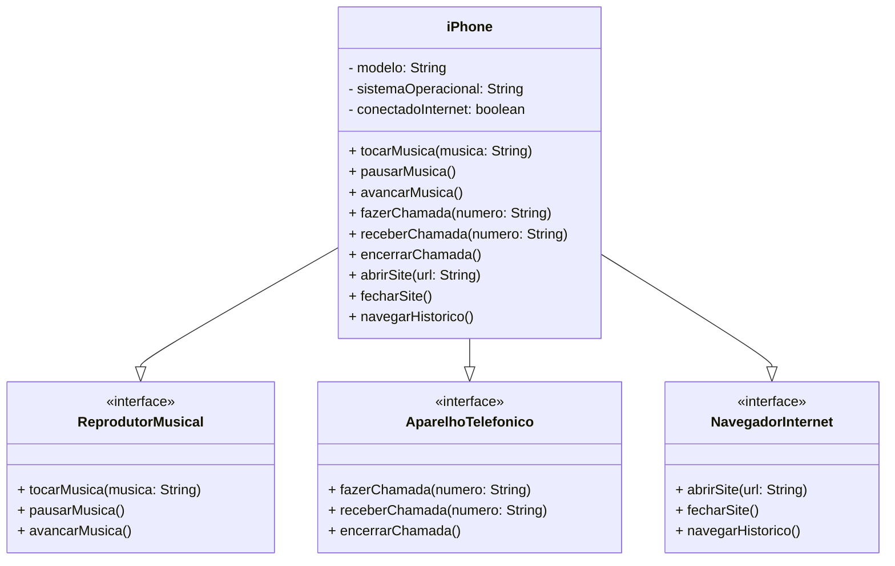

# UML-iphone

Desafio diagrama UML iphone

```mermaid
classDiagram
    class iPhone {
        - modelo: String
        - sistemaOperacional: String
        - conectadoInternet: boolean
        + tocarMusica(musica: String)
        + pausarMusica()
        + avancarMusica()
        + fazerChamada(numero: String)
        + receberChamada(numero: String)
        + encerrarChamada()
        + abrirSite(url: String)
        + fecharSite()
        + navegarHistorico()
    }
    class ReprodutorMusical {
        <<interface>>
        + tocarMusica(musica: String)
        + pausarMusica()
        + avancarMusica()
    }

    class AparelhoTelefonico {
        <<interface>>
        + fazerChamada(numero: String)
        + receberChamada(numero: String)
        + encerrarChamada()
    }

    class NavegadorInternet {
        <<interface>>
        + abrirSite(url: String)
        + fecharSite()
        + navegarHistorico()
    }

    iPhone --|> ReprodutorMusical   
    iPhone --|> AparelhoTelefonico  
    iPhone --|> NavegadorInternet   

```
